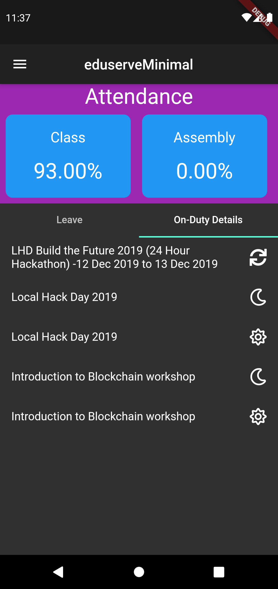
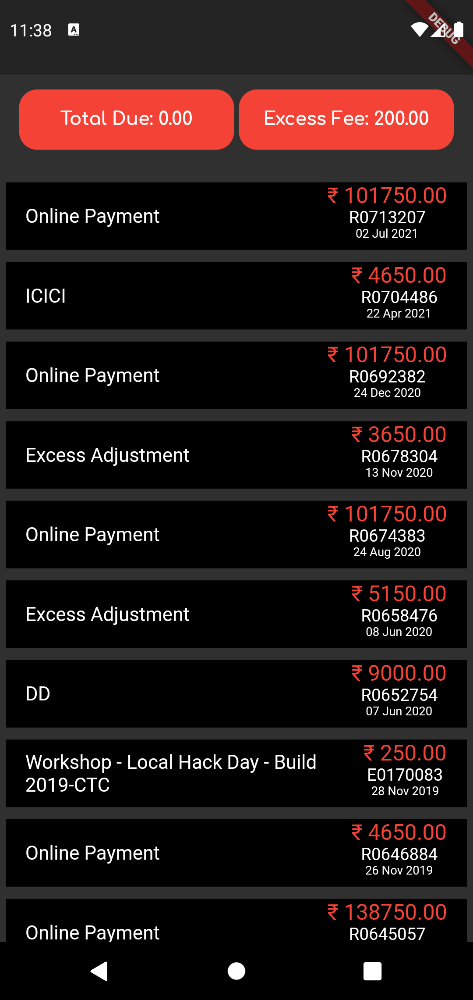
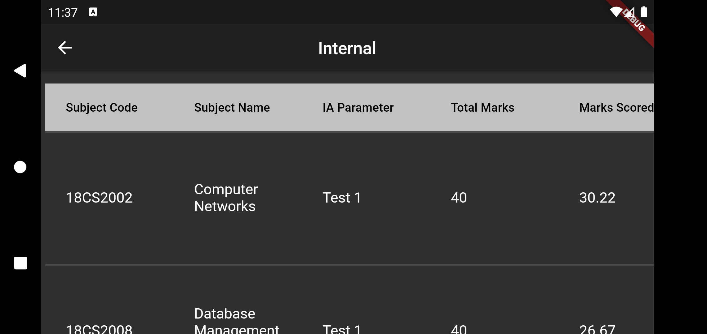

# eduserveMinimal

[![Website][website-shield]][website-url]

Minimalist app for eduserve

This branch contains code for flutter app. You can modify and build the app by your own or check the releases tab for any apk's.

<div id="download">
   
<a href='https://play.google.com/store/apps/details?id=com.hiruthicShaBuilds.eduserveMinimal&pcampaignid=pcampaignidMKT-Other-global-all-co-prtnr-py-PartBadge-Mar2515-1'></a>

For non-programming iOS users, follow these steps:

1. Throw your iphone out of the window and buy a android device then [download](#download).

OR

1. Download and install the flutter SDK
2. Compile it yourself. [_Process_](#compile)

## Start Building

<div id="compile">
   
1. ### Clone the repo

   ```bash
   git clone --recurse-submodules https://github.com/hiruthicShaSS/eduserveMinimal.git
   git checkout mobile_app
   ```

2. ### Build app

   ```bash
   flutter pub get
   flutter build apk
   ```

   - Platform specific:

     ```bash
     flutter build apk --target-platform "your platform"
     ```

   - Append '--release' or '--debug' for release app or debug app respectively.
   - More: [Build Flutter app](https://flutter.dev/docs/deployment/android)

## Screenshots

<div align="center">



</div>


[website-url]: https://hiruthicshass.github.io/eduserveMinimal/
[website-shield]: https://img.shields.io/website?label=GitHub%20Pages&style=for-the-badge&url=https://hiruthicshass.github.io/eduserveMinimal/
