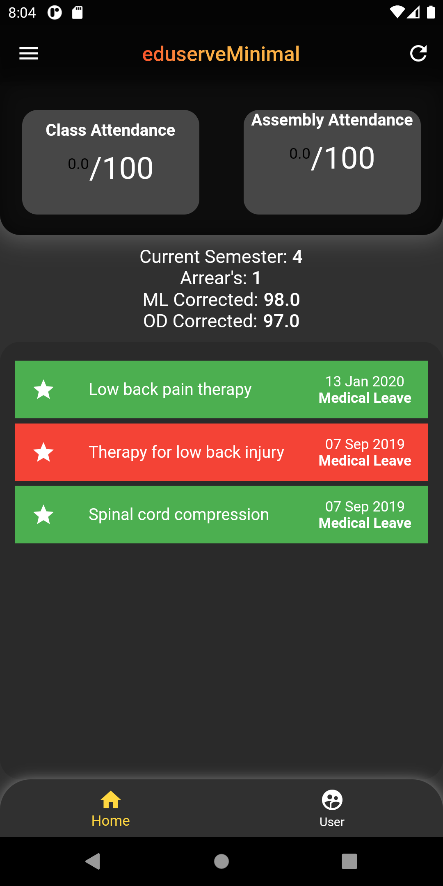
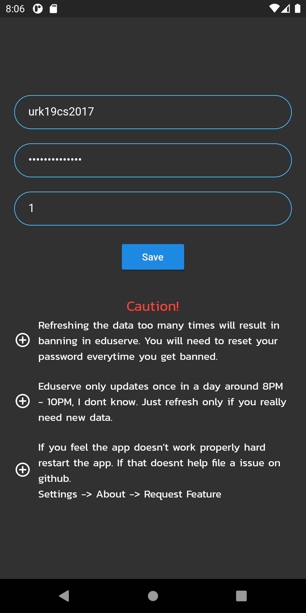
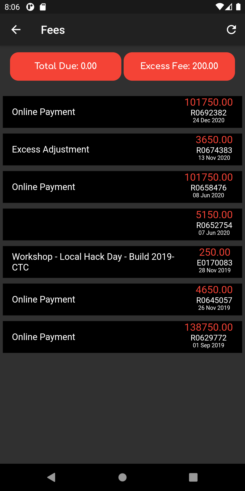

# eduserveMinimal

Minimalist app for eduserve

This branch contains code for flutter app. You can modify and build the app by your own or check the releases tab for any apk's.
_If you are using ios, YEET_

## Start Building

1. ### Clone the repo

   ```bash
   git clone https://github.com/hiruthic2002/eduserveMinimal.git
   git checkout mobile_app
   ```

2. ### Build app

   ```bash
   flutter pub get
   flutter build apk
   ```

   - Platform specific:

     ```bash
     flutter build apk --target-platform "your platform"
     ```

   - Append '--release' or '--debug' for release app or debug app respectively.
   - More: [Build Flutter app](https://flutter.dev/docs/deployment/android)

<br />

## Screenshots
<div align="center">



</div>
