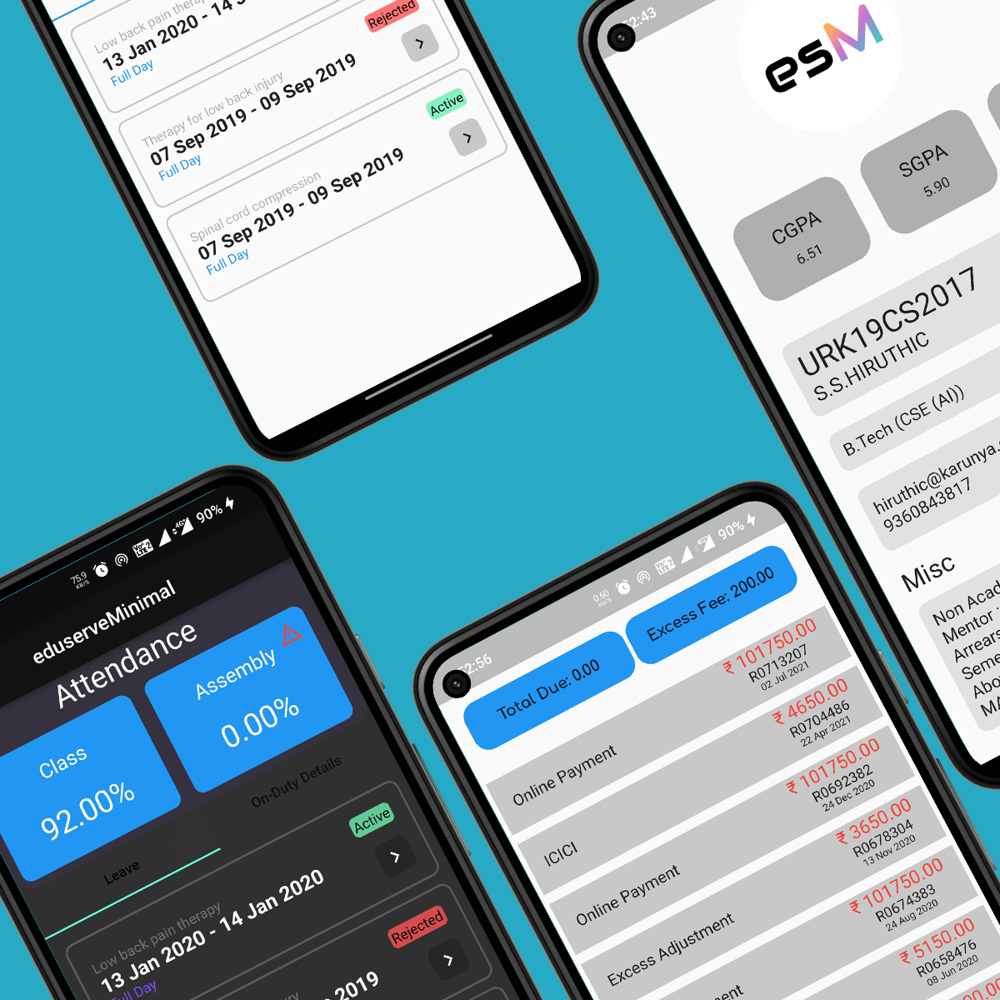
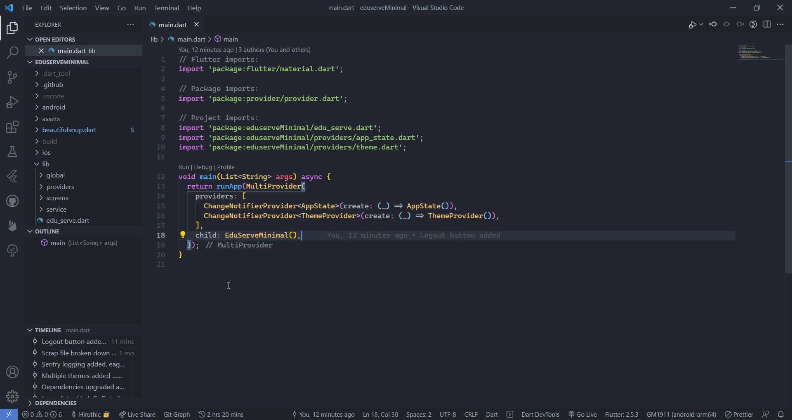
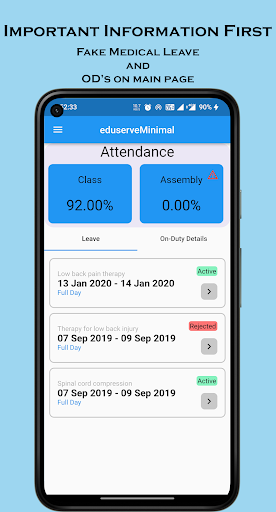
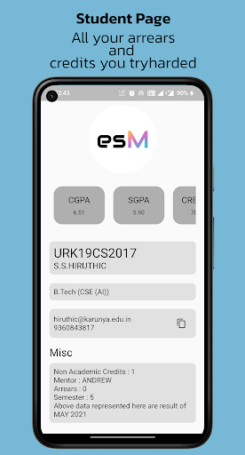
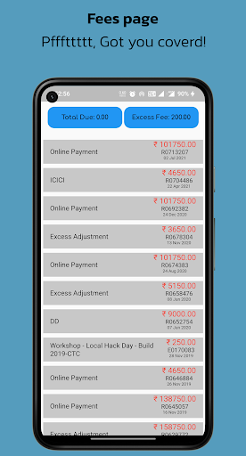
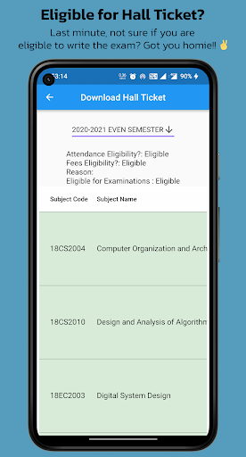
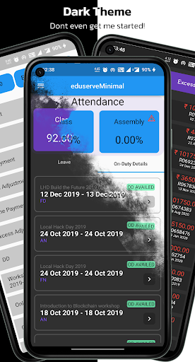

# eduserveMinimal
<!-- ALL-CONTRIBUTORS-BADGE:START - Do not remove or modify this section -->
[](#contributors-)
<!-- ALL-CONTRIBUTORS-BADGE:END -->

Minimalist app for eduserve



[![Website][website-shield]][website-url]


## Download

<a href='https://play.google.com/store/apps/details?id=com.hiruthicShaBuilds.eduserveMinimal&pcampaignid=pcampaignidMKT-Other-global-all-co-prtnr-py-PartBadge-Mar2515-1'></a>

For non-programming iOS users, follow these steps:

1. Throw your iphone out of the window and buy a android device then [download](#download).

OR

1. Download and install the flutter SDK
2. Compile it yourself. [_Process_](#start-building)

## Start Building

### Clone the repo

```bash
git clone --recurse-submodules https://github.com/hiruthicShaSS/eduserveMinimal.git
```

---

- [Terminal (or CMD)](#terminal-or-cmd)
- [VS Code](#vs-code)

---

- #### Terminal (or CMD)

  1. #### Get packages

      ```bash
      flutter pub get
      ```

  2. #### Build app

     ```bash
     flutter build apk --target lib/main_production.dart \
     --flavor production
     ```

     - Platform specific:

       ```bash
       flutter build apk --target lib/main_production.dart \
       --flavor production --target-platform "your platform"
       ```

     - Append '--release' or '--debug' for release app or debug app respectively.
     - More: [Build Flutter app](https://flutter.dev/docs/deployment/android)

- #### VS Code

  1. Download this [file](https://gist.github.com/hiruthicShaSS/b8398a7ebb6ead5e1b7b3a357cdafa95) and place this under .vscode/ inside your project 
  3. Open Run and Debug Code tab `Cmd / Ctrl + Shift + D`
  4. Click the dropdown and select the build type.
  5. Start Debugging `F5`

  

## Screenshots







[website-url]: https://hiruthicshass.github.io/eduserveMinimal/
[website-shield]: https://img.shields.io/website?label=GitHub%20Pages&style=for-the-badge&url=https://hiruthicshass.github.io/eduserveMinimal/

## Contributors ✨

Thanks goes to these wonderful people ([emoji key](https://allcontributors.org/docs/en/emoji-key)):

<!-- ALL-CONTRIBUTORS-LIST:START - Do not remove or modify this section -->
<!-- prettier-ignore-start -->
<!-- markdownlint-disable -->
<table>
  <tr>
    <td align="center"><a href="http://hiruthicsha.com"><br /><sub><b>Hiruthic</b></sub></a><br /><a href="#projectManagement-hiruthicShaSS" title="Project Management">📆</a></td>
    <td align="center"><a href="https://github.com/sachinravikumar"><br /><sub><b>Sachin R</b></sub></a><br /><a href="#business-sachinravikumar" title="Business development">💼</a></td>
    <td align="center"><a href="https://github.com/shivnesh646"><br /><sub><b>shivnesh646</b></sub></a><br /><a href="#business-shivnesh646" title="Business development">💼</a></td>
  </tr>
</table>

<!-- markdownlint-restore -->
<!-- prettier-ignore-end -->

<!-- ALL-CONTRIBUTORS-LIST:END -->

This project follows the [all-contributors](https://github.com/all-contributors/all-contributors) specification. Contributions of any kind welcome!